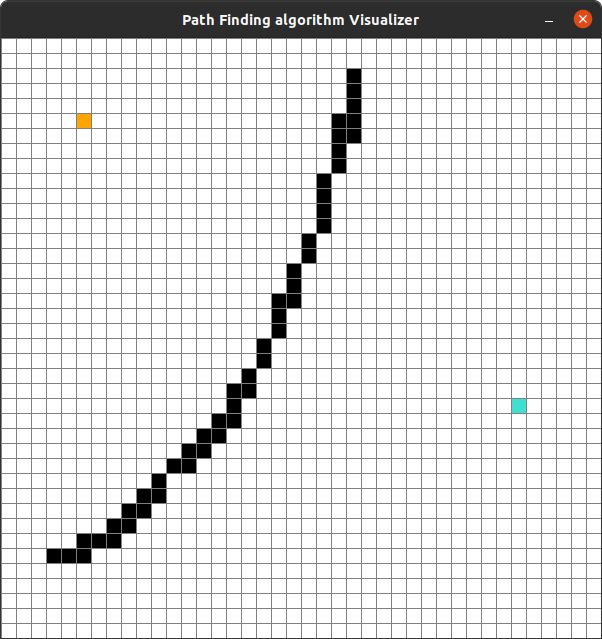
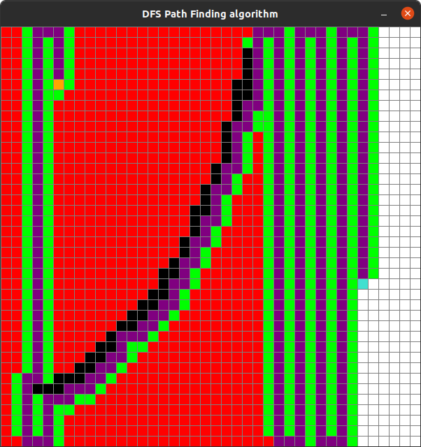
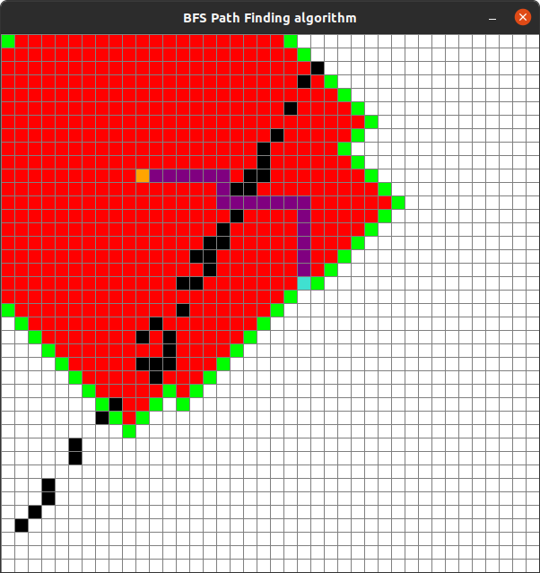
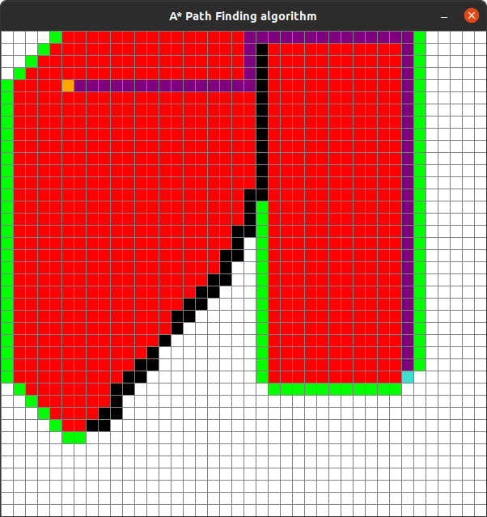

# Path Finding Algorithm Visualizers &middot; [](https://github.com/mishrakeshav/Path-Finding-Algorithm-Visualizer/blob/master/LICENSE)
> A picture is speaks a thousand words

This is a fun project to learn algorithms and also visualize it for better understanding.  

## Installing / Getting started

First install all the requirements using the requirements and then run the files of the respective algorithm you want to visualize

```shell
pip install -r requirements.txt
```
<ul>
  <li>Run the run.py file</li>
  <li>Press A to run the DFS Algorithm.</li>
  <li>Press S to run the DFS Algorithm.</li>
  <li>Press D to run the A* Algorithm.</li>
  <li>Press C to clear the screen.</li>
</ul>
 


## Screenshots 




### Built With
Python, Pygame


### Setting up Dev

Here's a brief intro about what a developer must do in order to start developing
the project further:

```shell
git clone https://github.com/mishrakeshav/Path-Finding-Algorithm-Visualizer.git
cd Path-Finding-Algorithm-Visualizer/
pip install -r requirements.txt
```


## Licensing

THE SOFTWARE IS PROVIDED "AS IS", WITHOUT WARRANTY OF ANY KIND, EXPRESS OR
IMPLIED, INCLUDING BUT NOT LIMITED TO THE WARRANTIES OF MERCHANTABILITY,
FITNESS FOR A PARTICULAR PURPOSE AND NONINFRINGEMENT. IN NO EVENT SHALL THE
AUTHORS OR COPYRIGHT HOLDERS BE LIABLE FOR ANY CLAIM, DAMAGES OR OTHER
LIABILITY, WHETHER IN AN ACTION OF CONTRACT, TORT OR OTHERWISE, ARISING FROM,
OUT OF OR IN CONNECTION WITH THE SOFTWARE OR THE USE OR OTHER DEALINGS IN THE
SOFTWARE.
